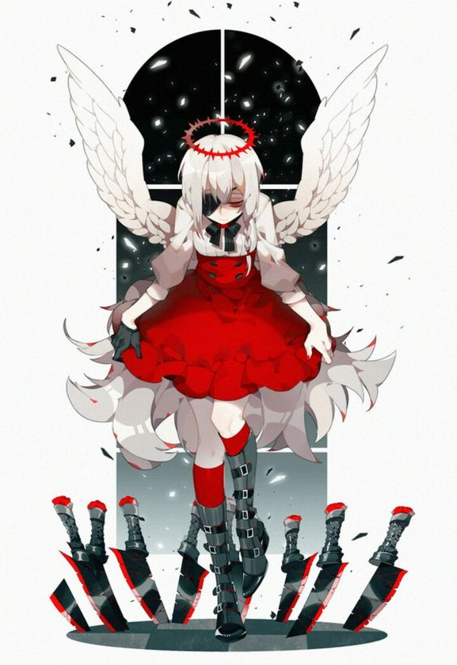

<body>
<br>
<div align="center">

</div>
<br>

<h2 align="center"> 👁️‍🗨️ About me 👁️‍🗨️ </h2>

```zsh
> ur local e-girl
```

 


<!--
**ar-Kitty/ar-Kitty** is a ✨ _special_ ✨ repository because its `README.md` (this file) appears on your GitHub profile.

Here are some ideas to get you started:

- 🔭 I’m currently working on ...
- 🌱 I’m currently learning ...
- 👯 I’m looking to collaborate on ...
- 🤔 I’m looking for help with ...
- 💬 Ask me about ...
- 📫 How to reach me: ...
- 😄 Pronouns: ...
- ⚡ Fun fact: ...
-->
